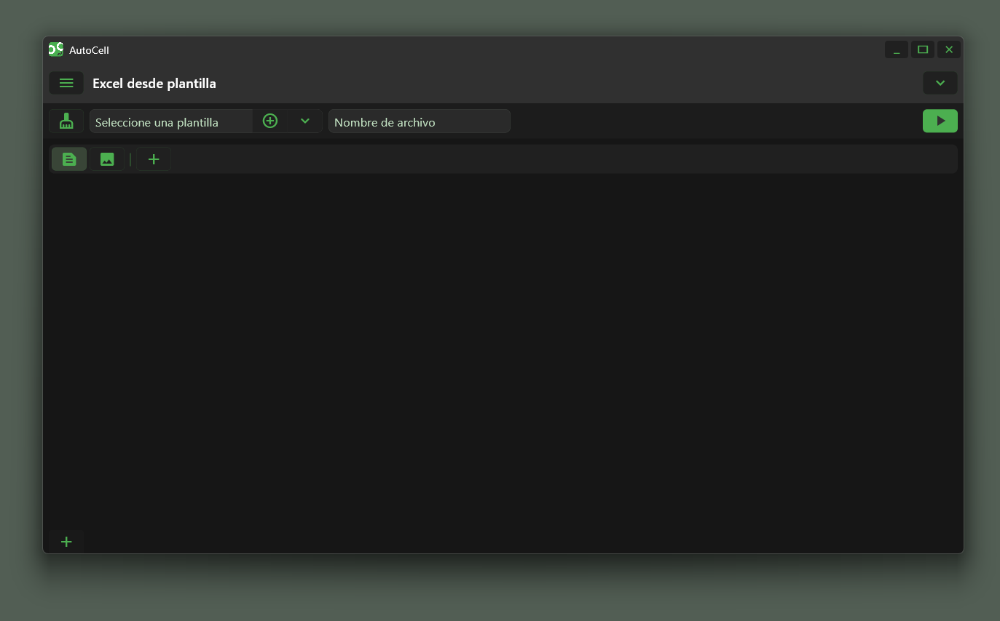

Esta es una versión en desarrollo del programa AutoCells.

El software está pensado para realizar acciones que en Excel que no están disponibles por el momento. A futuro, espero añadir opciones para interactuar con Google Sheets y otras automatizaciones más complejas.

Esta es una posible lista de lo planeado:
- Comparación de documentos
- Colocar la misma imágen en varios documentos
- Editar documentos de manera masiva
- Análisis de varios documentos

Con tu aporte y tus comentarios podré darle forma a este proyecto.

Si deseas puedes realizar una donación dando clic [aquí](https://ko-fi.com/ronvidev) o en la imagen.

